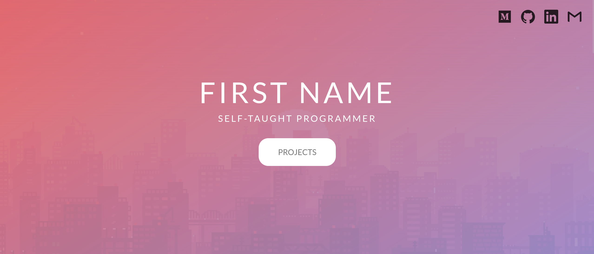

# "Candy" Personal Website Portfolio Template

This template is designed for personal portfolios, showcasing your skills and projects.

## Get Started

1. Clone or Download: Clone this repository or download the ZIP file.
2. Customize: Replace placeholders (e.g., `YOUR_FULL_NAME`, `YOUR_USER`, `YOUR_EMAIL_ADDRESS`) with your actual information.
3. Add Your Projects: Update the `section-projects` section with your projects. Include images, titles, descriptions, and links to the source code.
4. Upload Images: Place your images in the `assets/images` directory. Update the `src` attributes in the HTML to match your image filenames.
5. Update Social Links: Replace the URLs in the navigation bar and footer with your actual social media profiles.

## Features

- Responsive Design: Ensures your portfolio looks great on any device.
- Interactive Elements: Smooth scrolling and hover effects enhance user experience.
- Customizable: Easily update your information, projects, and social links.
- Social Media Integration: Connect your LinkedIn, GitHub, and other profiles.

## Contributing

Contributions are welcome If you have suggestions for improvements or bug reports, please open an issue.

## License

This project is licensed under the MIT License. See the `LICENSE` file for details.
